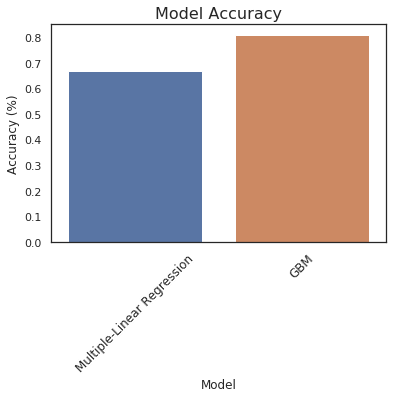
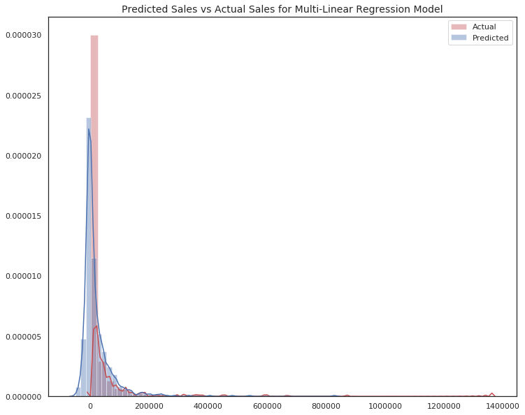

# Predicting Sales Performance based off Product Features
**Project Report**

## Abstract
This project utalizes machine learning to develope a regression model to predict periodic sales performance based off given product features. The concluding model chosen was a Gradient Boosting Model with a 81% accuracy. Feature selection and data pre-processing are key to the model's performance.

## Introduction
In a tangible product environment, whether brick n' mortar or e-commerce, B2B, B2C, or even B2G, strategic decisions need to be formulated and implemented based on the prediction of a product's success. 

Typical forecasting models such as Prophet and ARIMA tend to provide value in the realm of trend and pattern identification, however in formulating decisions based off typical business domain knowledge, such as product features, marketing and advertising campaigns, and supply chain initiatives, the typical forecasting model becomes ignorant to the influence this data has on predicting product success.
    
The aim of this project is to build as good a model as possible to determine the sales performance based off domain knowledge, specifically a portfolio of product features. We can imagine the products are atleisure active apparel clothing items for an e-commerce store. 

**This document outlines topics of the model's methodology, modelling tools and techniques, and provides a summary of results and final discussion points. For a detailed code repository, please see attached [Jupyter Notebook](https://github.com/kyle-walden/ML-Predicting-Sales-Performance-based-off-Product-Features/blob/master/Predicting%20Sale%20Performance%20using%20Product%20Features%20(1).ipynb) to this repository.**

## Methodology
### Dataset
The data was obtained from [this kaggle dataset](https://www.kaggle.com/c/online-sales/data). Each row in the data set represents a different product:
* The first 12 columns (Outcome_M1 through Outcome_M12) contains the monthly sales outcomes for the first 12 months after the product launches.
* Date_4 is the product launch date.
* Quan_x are quantitative variables and Cat_x are categorical variables.
* Binary categorical variables are measured as (1) if the product had the feature and (0) if it did not.

### Modelling
The programming language of choice was Python. Numerous libraries were used throughout the coding script, namely Pandas, NumPy, Scikit-Learn, Seaborn, Matplotlib, and Statsmodels.

In scope of feature selection, a standard OLS backwards elimination method was used as well as utalising VIF to address multi-collinearity. Simple feature engineering was conducted on the outcome vairables and time vairable.

Two regression models were trained to fit the data, namely a [Gradient Boosting Model](http://scikit-learn.org/stable/modules/generated/sklearn.ensemble.GradientBoostingRegressor.html) and [Multi-Linear Regression Model](http://scikit-learn.org/stable/modules/generated/sklearn.linear_model.LinearRegression.html)(click to read more on a model's scope).

## Results
Both models were tested, with the Gradient Boosting Model (accuracy of 81%) performing better than the Multi-Linear Regression Model (67% accuracy). Several plots are available below to visualise the performance of each model:

## Discussion
The concluding Gradient Boosting Model explains 81% of a product's sale success. The better-developed model would comprise of more domain knowledge features. Additional product feature data would comprise of inputs from advertising campaign data, customer portfolio data, distribution channels, etc. to strive for a closer-to-one variance score. A couple things to note on the model:
* The model does not consider a product's life-cycle, therefore the imputation of the "number of sales months" coefficient must be considered carefully with a marketing department.
* Feature selection contributed to an increased variance score - we started off with 546 model features and resulted in 78 final product features that explain our model.
